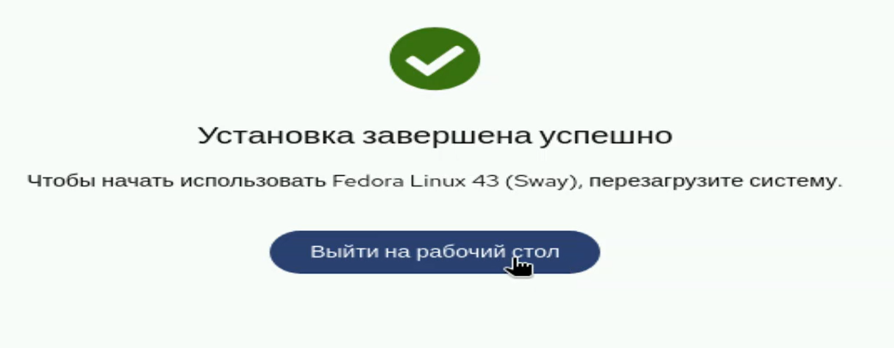
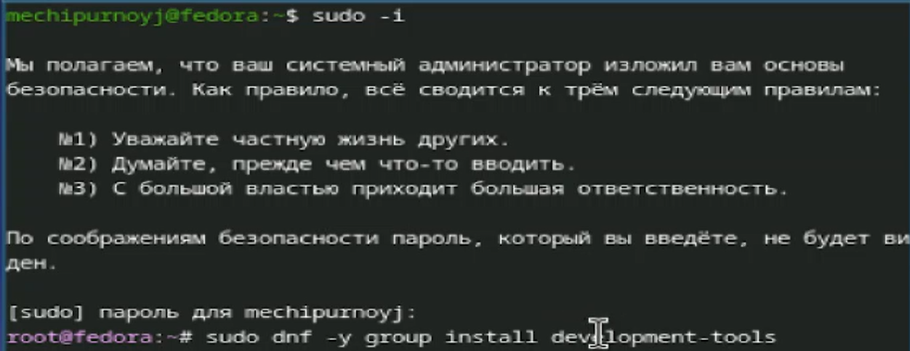
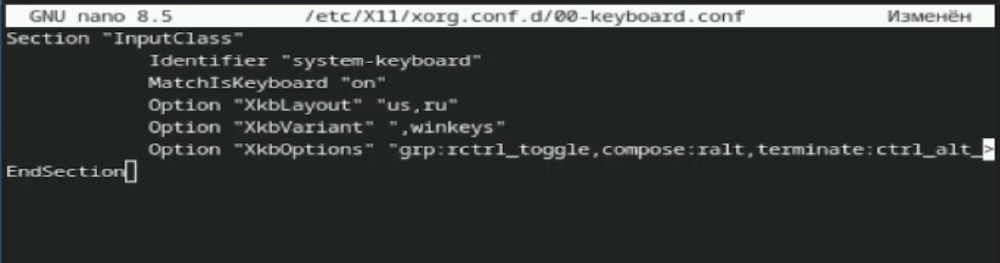
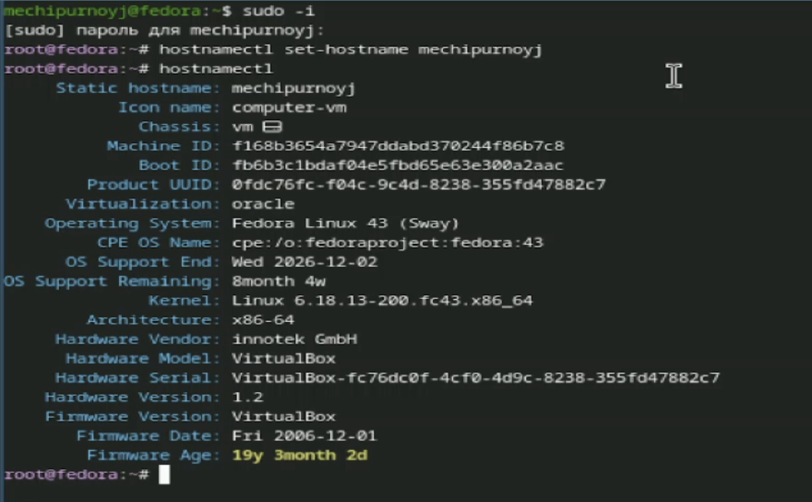
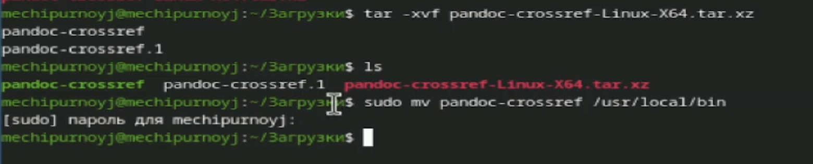
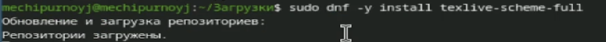
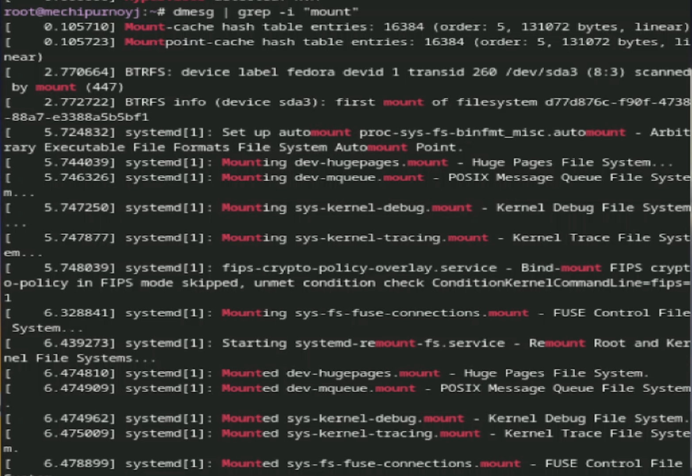

# Информация

## Докладчик

:::::::::::::: {.columns align=center}
::: {.column width="70%"}

* Чипурной Михаил Евгеньевич
* студент
* Российский университет дружбы народов
* [1032253636@rudn.ru](mailto:1032253636@rudn.ru)

:::
::: {.column width="30%"}

{width=300px}

:::
::::::::::::::

# Выполнение лабораторной работы

## Устанавливаем Fedora на VM

{width=90% height=90%}

Процесс установки...

## Переходим в режим суперпользователся и устанавливаем средства разработки

:::::::::::::: {.columns align=center}
::: {.column width="80%"}

{width=100%}

:::
::::::::::::::

## Обновляем все пакеты

:::::::::::::: {.columns align=center}
::: {.column width="80%"}

{width=100%}

:::
::::::::::::::

## Устанавливаем программы для удобства работы в консоли

:::::::::::::: {.columns align=center}
::: {.column width="80%"}

{width=100%}

:::
::::::::::::::

## Устанавливаем программное обеспечение для автоматического обновления

:::::::::::::: {.columns align=center}
::: {.column width="80%"}

{width=100%}

:::
::::::::::::::

## Запускаем таймер

:::::::::::::: {.columns align=center}
::: {.column width="80%"}

{width=100%}

:::
::::::::::::::

## Отключаем SELinux

:::::::::::::: {.columns align=center}
::: {.column width="80%"}

{width=100%}

:::
::::::::::::::

## Настраиваем раскладку клавиатуры

:::::::::::::: {.columns align=center}
::: {.column width="80%"}

{width=100%}

:::
::::::::::::::

## Устанавливаем имя хоста

:::::::::::::: {.columns align=center}
::: {.column width="80%"}

{width=100%}

:::
::::::::::::::

## Устанавливаем pandoc

:::::::::::::: {.columns align=center}
::: {.column width="80%"}

{width=100%}

:::
::::::::::::::

## Устанавливаем pandoc-crossref

:::::::::::::: {.columns align=center}
::: {.column width="80%"}

{width=100%}

:::
::::::::::::::

## Устанавливаем texlive

:::::::::::::: {.columns align=center}
::: {.column width="80%"}

{width=100%}

:::
::::::::::::::

# Домашнее задание

## Анализируем последовательность загрузки системы командой dmesg

:::::::::::::: {.columns align=center}
::: {.column width="80%"}

{width=100%}

:::
::::::::::::::

# Вывод

- Мы приобрели практические навыки по установке ОС на ВМ, а также настройке необходимых сервисов

