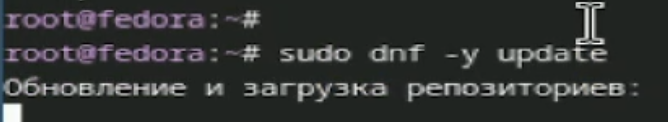
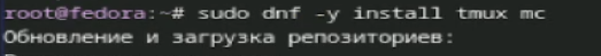
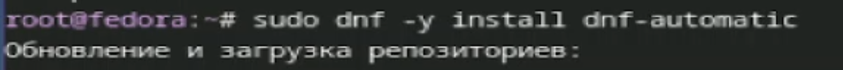
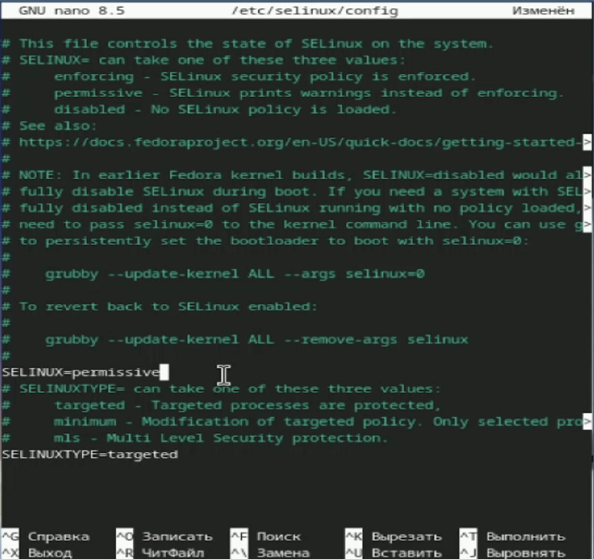
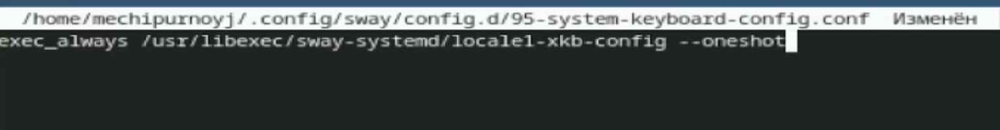
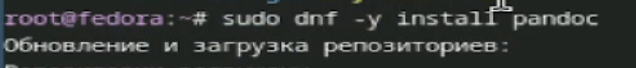

---
## Author
author:
  name: Чипурной Михаил Евгеньевич
  studID: 1032253636
  group: НПИбд-03-25
  email: 1032253636@pfur.ru
license: "CC BY"

## Title
title: "Отчет по лабораторной работе №1"
subtitle: "Дисциплина: Архитектура компьютера"
---

# Цель работы

Целью данной работы является приобретение практических навыков установки операционной системы на виртуальную машину, настройки минимально необходимых для дальнейшей работы сервисов

# Задание

Установить OC Linux

# Выполнение лабораторной работы

Устанавливаем систему на диск (рис. @fig-a).

{#fig-a width=70%}

Переходим в режим суперпользователя и устанавливаем средства разработки (рис. @fig-b).

{#fig-b width=70%}

Обновляем все пакеты (рис. @fig-c).

{#fig-с width=70%}

Устанавливаем программы для удобства работы в консоли (рис. @fig-d).

{#fig-d width=70%}

Устанавливаем программное обеспечение для автоматического обновления (рис. @fig-e).

{#fig-e width=70%}

Запускаем таймер (рис. @fig-f).

{#fig-f width=70%}

Отключаем SELinux (рис. @fig-g).

{#fig-g width=70%}

Редактируем конфигурационный файл ~/.config/sway/config.d/95-system-keyboard-config.conf (рис. @fig-h).

{#fig-h width=70%}

Редактируем конфигурационный файл /etc/X11/xorg.conf.d/00-keyboard.conf (рис. @fig-i).

{#fig-i width=70%}

Устанавливаем имя хоста (рис. @fig-j).

{#fig-о width=70%}

Устанавливаем pandoc (рис. @fig-k).

{#fig-k width=70%}

Устанавливаем pandoc-crossref (рис. @fig-z)

{#fig-z width=70%}

Устанавливаем texlive (рис. @fig-l).

{#fig-l width=70%}

## Домашнее задание

Получаем информацию о системе с помощью grep (рис. @fig-m).

{#fig-m width=70%}

## Контрольные вопросы

1. Какую информацию содержит учетная запись пользователя?  
Ответ: Учетная запись содержит имя пользователя (логин), UID (числовой идентификатор пользователя), GID (основная группа), текстовое описание (GECOS), путь к домашнему каталогу и имя входной оболочки; сведения о пароле и сроках его действия хранятся в отдельном файле /etc/shadow в виде хеша.

2. Команда для получения справки по команде (с примерами).  
Ответ: Для подробной справки используют `man команда` (например, `man ls`), для краткой — `команда --help` (например, `ls --help`).

3. Команды для перемещения по файловой системе (с примерами).  
Ответ: `pwd` показывает текущий каталог; `cd /путь/к/каталогу` (например, `cd /etc`) переходит в указанный каталог; `cd ..` поднимает на уровень выше.

4. Команды для просмотра содержимого каталога (с примерами).  
Ответ: `ls` выводит имена файлов и каталогов; `ls -l` показывает расширенную информацию о файлах (права, владелец, размер, дата); `ls -a` отображает также скрытые файлы; можно комбинировать: `ls -la`.

5. Команды для определения объёма каталога (с примерами).  
Ответ: `du -sh /путь/к/каталогу` выводит общий размер каталога в удобном виде (например, `du -sh /home`); `du -h --max-depth=1` показывает размеры подкаталогов текущего каталога на один уровень вложенности.

6. Команды для создания / удаления каталогов / файлов (с примерами).  
Ответ:  
- Создание каталогов: `mkdir имя_каталога` (например, `mkdir lab1`), создание вложенных структур: `mkdir -p dir1/dir2/dir3`.  
- Удаление пустого каталога: `rmdir имя_каталога`.  
- Создание пустого файла: `touch file.txt`.  
- Удаление файла: `rm file.txt`.  
- Удаление каталога с содержимым: `rm -r dir` или принудительно `rm -rf dir` (требует осторожности).

7. Команды для задания определённых прав на файл / каталог (с примерами).  
Ответ: Права изменяются командой `chmod`.  
- Символьный формат: `chmod u+x script.sh` (добавить владельцу право на исполнение), `chmod o-w file.txt` (запретить запись «остальным»).  
- Числовой формат: `chmod 755 script.sh` (владелец: rwx, группа и остальные: r-x), `chmod 644 file.txt` (владелец: rw-, остальные: r--).  
При необходимости меняют владельца и группу: `chown user:group file.txt`.

8. Команды для просмотра истории команд (с примерами).  
Ответ: `history` выводит список введённых команд; `!N` повторяет команду с номером N (например, `!25`); в интерактивном режиме bash можно искать по истории сочетанием клавиш Ctrl+R и вводом части команды.

9. Что такое файловая система?  
Ответ: Файловая система — это способ организации и хранения данных на носителе (разделе диска), определяющий структуру каталогов и файлов, набор метаданных (права, владельцы, временные метки) и методы доступа к этим данным.

10. Примеры файловых систем с краткой характеристикой.  
Ответ:  
- ext2: старый формат Linux без журналирования, простая, сейчас почти не используется.  
- ext3: развитие ext2 с добавлением журналирования, повышенная надёжность при сбоях.  
- ext4: современная журналируемая файловая система Linux, поддерживает большие файлы и разделы, применяется как основная во многих дистрибутивах.  
- XFS: журналируемая файловая система, хорошо масштабируется на большие тома и высокие нагрузки (часто на серверах).  
- Btrfs: современная Linux‑файловая система с поддержкой снимков, проверкой целостности и продвинутым управлением томами.  
- FAT/FAT32: простая система без журналирования, широко поддерживается разными ОС, используется на флеш‑накопителях, имеет ограничения по размеру файлов.  
- NTFS: основная файловая система Windows, журналируемая, поддерживает большие файлы и списки контроля доступа; в Linux обычно используется для дополнительных разделов.

11. Как посмотреть, какие файловые системы подмонтированы в ОС?  
Ответ:  
- Команда `mount` без параметров выводит список смонтированных файловых систем и точек монтирования.  
- `df -Th` показывает типы файловых систем и занятое/свободное место по точкам монтирования.  
- `lsblk -f` выводит блочные устройства с указанием типов файловых систем и точек монтирования.  
- В файле `/etc/fstab` указаны файловые системы, которые монтируются автоматически при загрузке.

12. Как удалить (убить) зависший процесс?  
Ответ:  
1) Сначала находят процесс: `ps aux | grep имя` либо в интерактивных утилитах `top`/`htop`.  
2) Пытаются корректно завершить: `kill PID` (отправка сигнала SIGTERM).  
3) Если процесс не завершился, применяют принудительное завершение: `kill -9 PID` (сигнал SIGKILL).  
4) Для завершения по имени используют `pkill имя_процесса` или `killall имя_процесса`, что посылает сигнал всем процессам с этим именем.

# Выводы

Мы приобрели практические навыки по установке OC На ВМ, а также настройке необходимых сервисов.

