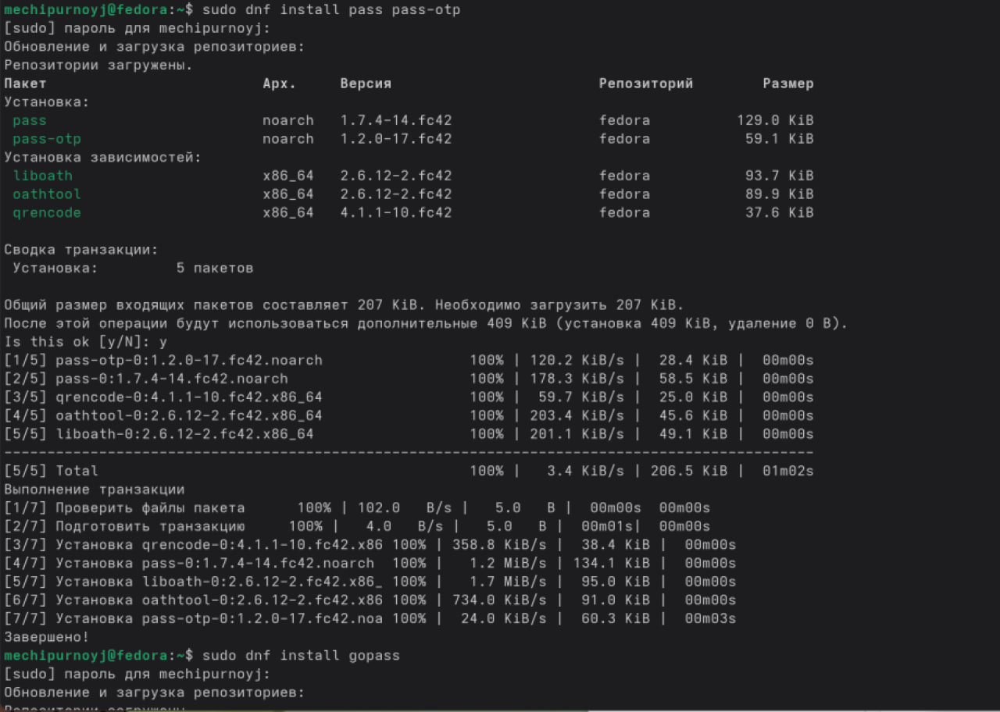
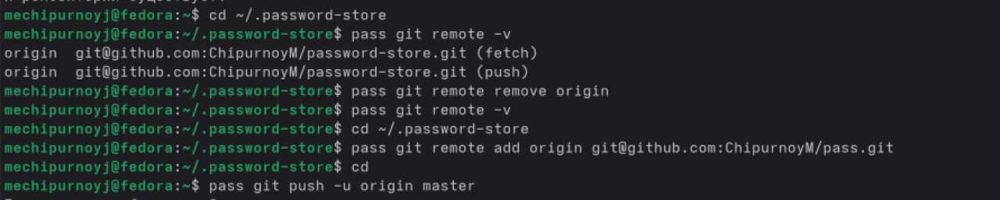
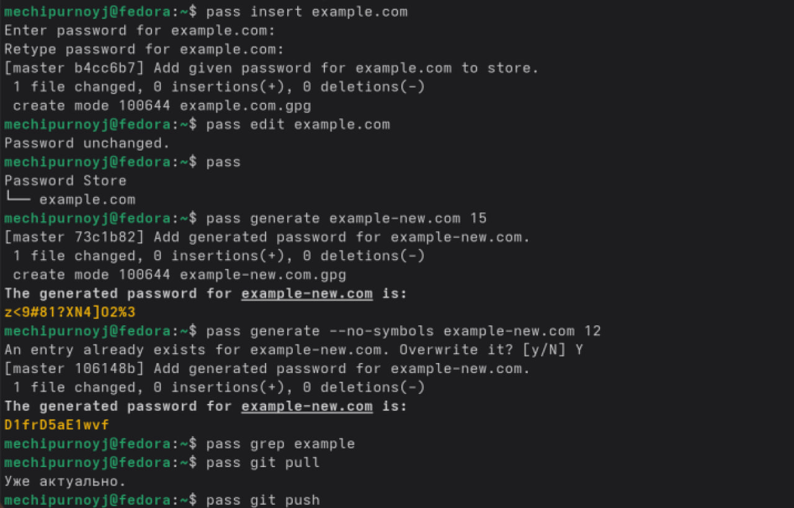
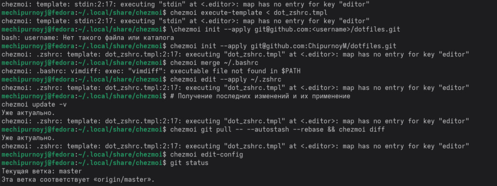

# Информация

## Докладчик

- ФИО: Чипурной Михаил Евгеньевич
- Группа: НПИбд-03-25
- Email: 1032253636@rudn.ru

# Цель работы

Изучить работу менеджера паролей pass.

# Установка pass

{width=70%}

# Синхронизация с git

{width=70%}

# Добавление пароля

{width=70%}

# Установка скрипта

{width=70%}

# Подключение репозитория

{width=70%}

# Выводы

- Установлен pass
- Настроена синхронизация с git
- Добавлены пароли

