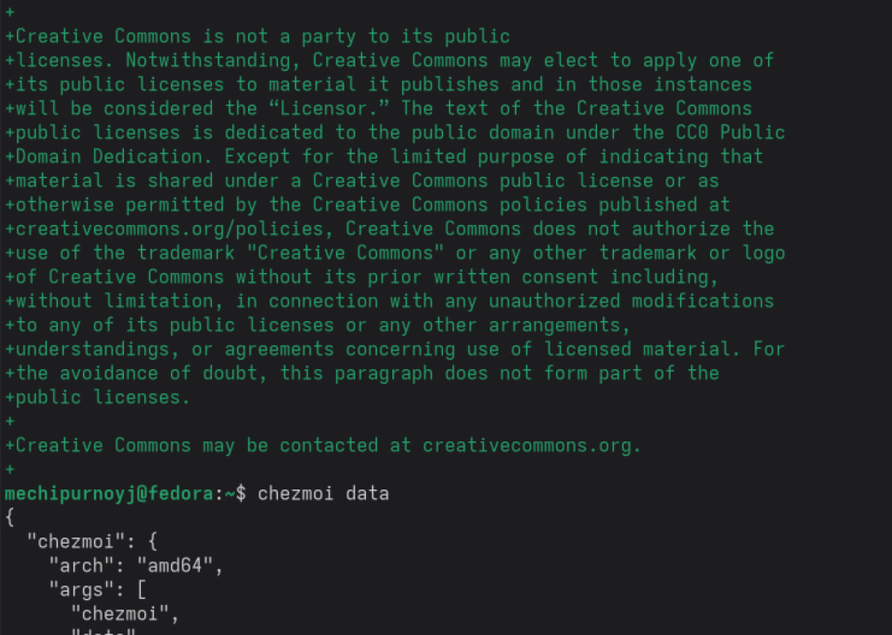

# Цель работы

Менеджер паролей pass — программа, сделанная в рамках идеологии Unix.
Также носит название стандартного менеджера паролей для Unix (The standard Unix password manager).

# Выполнение лабораторной работы

Менеджер паролей pass(рис. @fig-a)(рис. @fig-b)(рис. @fig-c)(рис. @fig-d)(рис. @fig-e).

{#fig-a width=70%}

{#fig-b width=70%}

{#fig-c width=70%}

{#fig-d width=70%}

{#fig-e width=70%}

# Выводы

Мы научились работать с менеджером паролей pass

